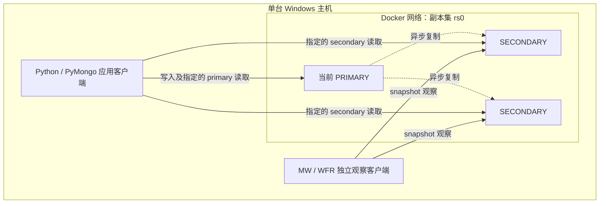
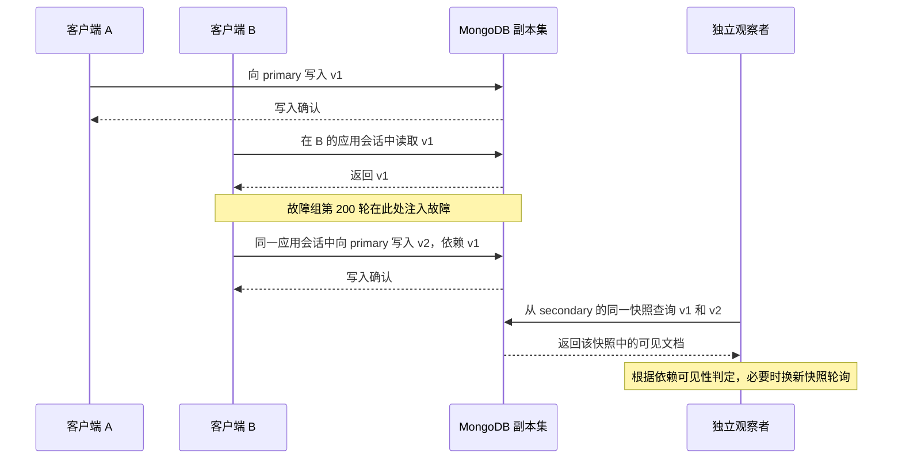
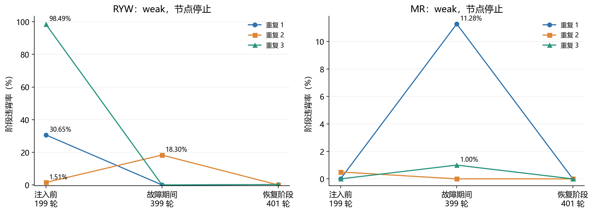
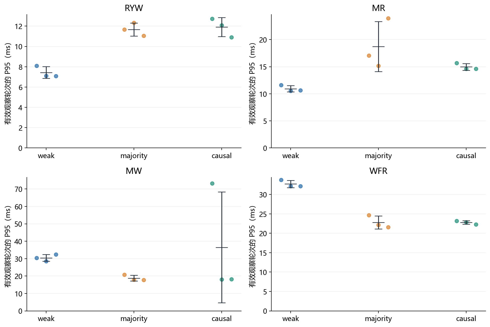

# MongoDB 可调一致性下的客户端中心一致性：配置对比与故障场景实验

> 中文协作初稿，2026-09-19。第 1—8 节正文已起草完成；摘要、AI 使用说明与复现附录待补充，英文翻译待中文全稿确认后进行。章节安排见 [最终报告框架](outline.zh.md)。

## 1. 引言与研究问题

### 1.1 研究背景

复制是分布式数据库的重要机制。将数据保存在多个节点上，可以在部分节点不可用时维持服务，并为不同的读取路径提供支持。MongoDB 通过副本集组织复制节点：在正常运行时，primary 接收写入，secondary 异步复制相关操作。由于副本更新存在时间差，从不同节点读取的数据状态可能并不相同。[1]

对于应用而言，问题不仅是数据最终能否同步，还包括同一个客户端连续操作时是否得到符合预期的结果。例如，用户更新购物车后再次查看，希望能够读到自己的修改；用户连续查看同一条记录时，也不希望已经看到的新版本又退回旧版本。这两类需求分别对应读己之写一致性（Read-Your-Writes，RYW）和单调读一致性（Monotonic Reads，MR）。类似地，客户端先后发出的写入需要保持顺序，而根据一次读取产生的后续写入需要保留相应依赖，这分别对应单调写一致性（Monotonic Writes，MW）和写跟随读一致性（Writes-Follow-Reads，WFR）。这些模型从客户端操作历史出发，为评价复制系统的可观察行为提供了具体标准。

MongoDB 提供读关注点、写关注点、读取偏好和会话等配置，使应用能够指定不同的读写要求。其中，因果一致性会话与 majority 读写关注点的结合具有明确的客户端一致性保障前提。[2] 因此，评估系统时需要区分配置所提供的理论保证、实验实际观察到的行为，以及请求因等待或超时而未完成的情况。

### 1.2 研究问题

本项目以三节点 MongoDB 副本集为对象，围绕以下三个问题开展实验。

**RQ1：不同一致性配置下，客户端观察到的行为有何差异？** 本项目比较 weak、majority 和 causal 三种配置，重点考察多数读写关注点与因果会话在本实验中的表现是否相同，以及哪些操作历史能够构成一致性的反例。

**RQ2：节点停止和网络分区前后，观测结果如何变化？** 本项目分别统计故障注入前、注入过渡、故障期间及恢复阶段的结果，分析一致性反例、操作错误和有效观察的分布，避免仅凭某个故障场景的总体比例判断故障影响。

**RQ3：未观察到违背能够支持什么结论？** 本项目特别关注 MW 和 WFR 的观测范围，区分已有可判定样本但未发现依赖缺失，与未观察到足以检验依赖的状态，并据此确定结论的适用范围。

### 1.3 研究范围与工作概述

本项目在同一台主机上部署三个 MongoDB 容器，通过 Python 客户端执行四种模型对应的操作序列。实验覆盖正常运行、primary 节点停止和网络分区三类场景，并比较三种配置。每个模型、场景和配置组合重复运行三次，每次执行 1,000 轮，共形成 108 组实验和 108,000 轮记录。这里的一轮可以包含多个数据库操作，不等同于一次数据库请求或一次独立统计试验。

实验将一致性判定与操作完成情况分别记录，同时保留实际访问节点、关注点、故障恢复事件和代码指纹，以便追溯观测依据。对于 RYW 和 MR，实验直接检查应用读取结果；对于 MW 和 WFR，实验采用独立观察者，检查同一个多数提交快照中的依赖完整性。因此，后两项实验的零违背结果只能在相应测量范围内解释，不能直接推广为任意操作历史下的完整模型保证。

本报告将先说明部署环境、配置含义和理论预测，再介绍操作序列、故障协议与统计方法，随后呈现结果并讨论其与预测的对应关系。研究的重点是用可复核的观测说明配置差异，同时明确有限实验所能支持的结论。

## 2. 系统架构与运行环境

### 2.1 三节点副本集部署

本项目使用 Docker Compose 在一台 Windows 主机上部署三个 MongoDB 实例，组成名为 `rs0` 的副本集。三个实例分别运行在 `mongo1`、`mongo2` 和 `mongo3` 容器中，均保存数据并参与选举，没有设置仲裁节点。正式实验记录显示，三个成员的投票数均为 1、选举优先级均为 1，且未配置人为的延迟副本。因此，这一部署中多数成员对应两个节点。

在正常稳定状态下，副本集包含一个 primary 和两个 secondary。primary 接收写入，secondary 异步复制相关操作；当 primary 不可用时，符合条件的 secondary 可以通过选举成为新的 primary。[1] 本项目不将某个容器固定视为 primary：正式实验各组开始时，三个容器都曾分别担任该角色。程序在故障注入前查询当前 primary，并记录每组实验开始和结束时的节点角色。

**图 1. 实验部署与客户端访问路径示意**



图中节点表示角色，不表示固定容器身份；两条 secondary 访问路径表示可选择的目标，并非每次请求同时读取两个节点。复制箭头用于说明逻辑关系，不表示实验固定了每个 secondary 的实际同步源。

三个容器通过共有的 Docker bridge 网络通信，并将各自的服务端口映射到宿主机。每个容器使用独立的数据卷保存 `/data/db`，容器停止与重启不会主动删除该卷。节点地址和端口配置如表 1 所示。

**表 1. 副本集成员与端口映射**

| 容器 | 副本集公布的成员地址 | 宿主机端口 → 容器端口 | 数据卷 |
|---|---|---|---|
| mongo1 | mongo1:27017 | 27017 → 27017 | mongo1_data |
| mongo2 | mongo2:27018 | 27018 → 27018 | mongo2_data |
| mongo3 | mongo3:27019 | 27019 → 27019 | mongo3_data |

这种部署能够在同一环境中控制节点停止和网络连接，便于重复执行实验。不过，三个节点共享宿主机资源，不能代表跨物理机或跨地域部署；本项目据此限定结果的推广范围。

### 2.2 软件版本与配置记录

本报告采用正式运行时保存的元数据确认软件版本。对 108 组记录的检查表明，MongoDB、PyMongo 和宿主平台标识保持一致；三个 MongoDB 成员的服务器版本均为 8.0.29。主要环境信息列于表 2。

**表 2. 正式实验环境**

| 组件或配置 | 实际版本 / 设置 |
|---|---|
| 宿主平台 | Windows，运行记录中的系统构建号为 10.0.26200 |
| 数据库部署 | 单机、三个 Docker 容器组成副本集 rs0 |
| MongoDB 服务器 | 8.0.29，三个成员一致 |
| Python | 3.11.5 |
| PyMongo | 4.18.0 |
| 副本集成员 | 三个数据节点；每节点 votes=1、priority=1 |
| 选举超时参数 | electionTimeoutMillis=10000 |
| 实验数据库 | dsa5208_v2；每组使用唯一 collection |

提交的 Compose 文件将镜像固定为 `mongo:8.0.29`。本次实验复用了原标签为 `mongo:8.0` 的已有容器，实际服务器版本由运行时查询确认，而不是仅根据镜像标签推断。选举超时参数同样来自副本集配置记录；它是系统参数，不能直接当作实测的故障恢复时长。

每组实验保存独立的元数据、逐轮记录、命令事件日志和统计摘要。元数据包含配置、初始与最终拓扑及代码 SHA-256，命令日志记录实际访问的服务器节点。后续结果分析仅使用最终正式批次，早期调试数据不参与统计。

### 2.3 客户端连接与读取路径

实验程序运行在宿主机，通过包含三个种子地址及 `replicaSet=rs0` 的连接配置访问副本集，由 PyMongo 根据拓扑和读取偏好选择服务器。读取偏好决定请求访问 primary 还是 secondary；读取所需满足的数据条件则由读关注点和会话设置共同约束，二者不能混为同一配置。[3]

同一模型在三种配置下保持相同的读取偏好，具体路径如表 3 所示。保持的是角色选择策略，实际访问的容器可能随拓扑和驱动选路变化。

**表 3. 各模型的客户端角色与访问路径**

| 模型 | 应用操作路径 | 独立客户端的作用 |
|---|---|---|
| RYW | 同一应用会话向 primary 写入，再从 secondary 读取本轮文档 | 无独立观察步骤 |
| MR | 读者在同一应用会话中依次读取 primary 和 secondary | 独立生产者向 primary 更新版本 |
| MW | 同一应用会话向 primary 顺序写入 | 独立观察者在 secondary 上读取同一快照中的依赖文档 |
| WFR | A 向 primary 写入；B 在自己的会话中从 primary 读取，再向 primary 写入依赖文档 | A 与 B 使用不同客户端；第三个客户端在 secondary 上进行快照观察 |

MW 和 WFR 的观察者不接收应用会话的因果时钟，其快照读取是统一的测量步骤。这样能够区分应用配置与观察方法，避免将应用和观察者放入同一因果会话所引入的额外约束。独立客户端均运行在同一台宿主机上，这里的“独立”指客户端实例和会话隔离，并不表示使用了不同物理机器。具体操作序列及快照判定范围将在第 4 节说明。

程序另外使用直连客户端检查节点健康和角色，这些管理连接不承担上述应用一致性读取。实验关闭自动读写重试，以保留操作失败的记录；相关超时和错误处理规则在实验方法中统一介绍。

### 2.4 安装、初始化与复现入口

环境准备包括 Python 依赖安装、容器启动和副本集初始化。在项目根目录创建虚拟环境并按 `requirements.txt` 安装固定依赖后，通过 Compose 启动三个数据库容器，随后运行初始化程序：

```powershell
python -m venv .venv
.\.venv\Scripts\python.exe -m pip install -r requirements.txt
docker compose up -d
.\.venv\Scripts\python.exe -m experiments.prepare
```

宿主机还需要将 `mongo1`、`mongo2`、`mongo3` 解析到 `127.0.0.1`，因为驱动在连接种子地址后会使用副本集公布的成员地址。本项目通过 hosts 配置实现该映射。初始化程序只对尚未初始化的副本集执行初始化；已有配置不符时返回错误，不自动重配。已有容器的环境可以直接复用，避免重复创建同名容器。

每组实验运行前检查三个节点属于同一副本集，并处于一个 primary、两个 secondary 的健康状态。网络分区的控制程序从实际容器配置中识别共有网络，以适应不同 Compose 项目名生成的网络名称。完整实验命令、错误恢复步骤和离线审计命令放入附录，正文在此保留复现所需的主要流程。

## 3. 一致性模型、配置与理论预测

### 3.1 四种客户端中心一致性模型

客户端中心一致性关注同一客户端操作之间的关系，而不仅是某次读取是否获得了系统中的最新数据。本项目研究的四种模型分别约束写后读、连续读取、连续写入和读后写四类操作序列。[2] 表 4 给出其含义以及本项目用于检验相关性质的观察。

**表 4. 一致性模型与本项目的检查对象**

| 模型 | 核心要求 | 本项目检查的观察 |
|---|---|---|
| RYW：读己之写 | 客户端完成写入后，后续读取应反映该写入或更新的状态 | 已确认插入的本轮不可变文档，是否能被同一会话的后续读取看到 |
| MR：单调读 | 同一客户端后续读取不应退回先前已观察状态之前 | 成功读取的版本是否小于该会话此前成功读取的最大版本 |
| MW：单调写 | 同一客户端先后发出的写入应保持应用顺序 | 可见的后续写入是否缺少其已经确认的前驱写入 |
| WFR：写跟随读 | 根据一次读取发出的后续写入，应在包含该读取所依赖写入的状态之上执行 | B 读到 A 的写入后产生依赖写；观察到依赖写时，其前提写入是否也存在 |

以本项目的整数版本为例，若读者先读到版本 8，随后读到版本 7，则构成 MR 的回退；若后一次仍读到版本 8，则不构成回退，即使系统中已经存在版本 9。这说明 MR 约束的是读取序列的单调性，而不是每次都读取全局最新版本。

对于依赖关系，可用 `w1 → w2` 表示后续写入 `w2` 依赖于先前写入 `w1`。在 MW 中，这条依赖来自同一客户端的写入顺序；在 WFR 中，它来自“读到 w1，再产生 w2”的操作链。两者的依赖来源不同，因此不能仅凭同一种可见性检查就将两种模型视为等价。

表中的后两项检查是对模型的有限操作化：本项目观察同一多数提交快照中的依赖完整性，不重建全部副本的历史应用顺序。若发现依赖缺失，还需结合日志区分前驱丢失与顺序问题；若未发现缺失，也不能据此证明所有历史都满足一般 MW/WFR。具体判定条件在第 4 节展开。

### 3.2 MongoDB 配置参数的不同作用

**写关注点（writeConcern）规定写入何时可以向客户端返回确认。** `w=1` 要求 primary 确认，不要求写入已经复制到 secondary。`w="majority"` 则要求满足多数确认条件。[4] 在本项目的三个投票数据节点中，多数为两个节点。

MongoDB 8.0 的一个重要细节是：多数数据节点持久化对应 oplog 条目后，即可满足多数写确认，节点随后异步应用操作。因此，收到多数确认并不意味着所选 secondary 已经将修改应用到可查询的数据中。官方文档明确指出，若应用在多数写确认后立即读取 secondary 并要求看到该修改，应在因果一致性会话中执行相关操作。[4] 这一机制为区分多数确认和客户端写后读约束提供了依据。

**读关注点（readConcern）规定读取的数据应满足什么条件。** `local` 允许返回目标节点本地可用的数据，不要求这些数据已获得多数提交确认，因此在某些故障历史中可能读到随后被回滚的数据。[5] `majority` 将读取限制在目标节点的多数提交视图内，但该视图仍可能落后于其他节点的状态。它并不自动要求本次读取的时间点晚于该客户端此前的某次操作。[6]

**读取偏好（readPreference）规定读取请求访问哪类节点。** 本项目使用 `PRIMARY` 和 `SECONDARY`：前者选择 primary，后者选择符合条件的 secondary。[3] 读取偏好决定访问路径，不能替代读关注点。例如，选择 secondary 并使用 majority 读取，并不等于任意 secondary 都已追上该客户端刚完成的写入。

**因果会话（causal session）将同一会话中的顺序操作关联起来。** 使用 `causal_consistency=True` 时，相关读取需要满足会话此前操作所建立的因果约束；读取 secondary 时，可能需要等待复制进度推进。[7] 在正确使用同一因果会话并采用 majority 读写关注点的前提下，MongoDB 文档给出了四种客户端一致性保证。[2] 这种约束不要求读取其他客户端的所有最新操作，也不将多个操作自动合并成一个原子事务。

以上参数分别涉及确认、数据可见条件、访问路径和跨操作关联。后续实验据此使用明确的配置组合，而不将所有参数概括为一个含义不清的“强弱等级”。

### 3.3 本项目比较的三种配置

三种配置在四个模型和三个场景中使用相同定义，如表 5 所示。所有组都显式创建应用会话，并明确设置因果一致性开关；因此，weak 和 majority 中的 False 表示没有启用应用会话的因果约束，而不是没有使用会话。

**表 5. 实验配置组合**

| 配置名称 | writeConcern | 应用 readConcern | 应用 causal_consistency |
|---|---|---|---|
| weak | w=1 | local | False |
| majority | w=majority | majority | False |
| causal | w=majority | majority | True |

同一模型在三种配置下保持第 2 节所述的读取偏好。majority 与 causal 的应用配置仅在因果会话开关上不同，因此能够更直接地比较启用该约束前后的表现。weak 与 majority 同时改变读写关注点，其差异只能解释为配置组合的差异，不能分别归因于某一个关注点。各组独立运行时的节点角色、复制进度和宿主机负载仍可能变化，实验不将组间数值差直接解释为精确的净因果效应。

MW/WFR 的观察者在三种配置下统一使用独立的 snapshot session。该会话从同一多数提交时间点读取数据，与应用会话的配置分开。[7] 因此，表 5 中的 local 或 majority 描述的是应用操作，不能误写成 MW/WFR 观察者的读取设置。保持观察方法一致，有利于比较配置，但多数提交快照同时限定了能够发现的异常类型。

### 3.4 理论预测及场景预期

结合上述语义与本项目的操作路径，表 6 给出用于对照实验结果的理论预期。表中“可能违背”表示该配置不能排除相应反例，并不表示每次运行都必须出现反例；“预计未发现依赖缺失”则针对本项目的快照检查，不代表一般模型已获证明。

**表 6. 本实验条件下的配置预测**

| 模型 | weak | majority | causal |
|---|---|---|---|
| RYW | secondary 可能落后于已确认写入，因此可能读不到自己的写入 | 多数确认不确保所选 secondary 的视图已推进至本次写入，因此仍可能出现反例 | 满足因果会话与 majority 读写前提时，成功的后续读取应反映自己的写入 |
| MR | primary 与 secondary 的状态可能不同，跨节点读取可能回退 | 不同节点的多数提交视图仍可能处于不同进度，不能据此排除回退 | 同一因果会话中的成功读取应保持单调性 |
| MW | 稳定单 primary 下的顺序写入预计不易产生依赖缺失；故障中的未多数提交前驱仍可能丢失 | 已确认前驱获得多数提交保护，本实验预计不易观察到依赖缺失 | 理论前提支持相应顺序保证，本实验预计未发现快照依赖缺失 |
| WFR | 稳定单 primary 可保留读后写依赖；故障中的依赖前提可能失去持久性，实际能否观测取决于故障窗口 | 应用读取与写入均采用 majority，本实验预计不易观察到已提交依赖缺失 | B 的读取与后续写入处于同一因果会话，本实验预计未发现快照依赖缺失 |

RYW/MR 的预测来自读取目标与可见状态之间的关系；MW/WFR 的预测还结合了本项目单 primary 写入、不可变依赖文档和多数提交快照的设计。后者是对特定工作负载的推断，不是将 MongoDB 因果会话的保证直接套用到所有配置。

在正常场景中，副本更新仍可能存在短暂时间差，但是否形成可观测反例取决于读取时机与选路。在节点停止和网络分区场景中，角色切换、复制状态以及可达节点会变化，可能引入等待、操作错误或不同的一致性观察。因此，本项目预计故障会改变操作执行条件，但不预设故障期违背率一定高于注入前，也不预设每种弱配置都能被当前故障方式触发反例。

对于 causal 配置，一致性保证与请求一定能够完成是两个不同问题。若相关节点暂时不可达，或无法在超时内满足约束，请求可能失败或超时；这类记录不能计为一致性通过。相应地，在 MW/WFR 中未观察到可检验的依赖写入，只能表示缺少判定依据。下一节将据此定义操作序列、有效样本和错误分类，使结果能够与上述预测逐项对照。

## 4. 实验设计与统计方法

### 4.1 实验矩阵与执行安排

实验采用四种模型、三种配置和三种场景的组合设计。每个组合执行三次重复，每次包含 1,000 轮，共计 108 组运行。每个重复块包含全部 36 个组合，并使用固定随机种子 5208 打乱执行顺序，以减少配置总是处于相同运行顺序位置带来的影响。所有组在同一副本集上串行执行，避免一组的故障注入直接干扰另一组正在进行的实验。

每组运行使用新的 collection、客户端实例和应用会话。开始正式循环前，程序统一采用 majority 写关注点插入初始化文档：MR 的寄存器初值为 0，其他模型插入运行标记。该初始化不计入 1,000 轮统计。程序不另外剔除开头的预热轮次，也不在普通轮次之间设置固定等待；因此，客户端初始连接状态和运行初期的副本进度也可能影响观测。

每组内的应用操作依次执行，同一应用会话跨轮保留。底层容器和数据卷在组间复用，不重建整个数据库环境。组间健康检查能够确认节点角色和可达性，但不意味着各组开始时的缓存、复制进度和宿主机负载完全相同。因此，三次重复用于观察运行间变动，不能把连续的 1,000 轮视为 1,000 次相互独立的试验。

### 4.2 四种模型的操作序列与判定

四种工作负载均围绕具有明确先后关系的操作设计。表 7 总结每轮流程和故障插入位置，其中“写入确认”按该组配置的写关注点判断；故障后的 primary 可能已由另一容器担任。

**表 7. 每轮操作序列与故障边界**

| 模型 | 正常完成一轮的操作序列 | 第 200 轮的故障插入位置 |
|---|---|---|
| RYW | 应用向 primary 插入本轮文档并获得确认 → 同一会话从 secondary 读取 | 插入确认后、读取前 |
| MR | 生产者更新版本 → 读者读取 primary → 同一读者会话读取 secondary | 两次读取之间 |
| MW | 应用写入并确认第一个文档 → 写入并确认第二个文档 → 独立快照观察 | 第一次写入确认后、第二次写入前 |
| WFR | A 写入前提文档 → B 读取该文档 → B 写入依赖文档 → 独立快照观察 | B 读到前提后、写入依赖文档前 |

**RYW。** 第 i 轮插入唯一文档 `ryw:i`，其版本值为 i，后续不覆盖或删除该文档。插入确认后，同一应用会话从 secondary 查询该文档；读到预期版本记为通过，查询正常返回但未找到该文档或版本不符记为违背。写入或读取发生数据库异常时，该轮记为错误。使用不可变的唯一文档，可以避免其他更新覆盖本轮写入而使判定变得含糊。

**MR。** 独立生产者先将寄存器更新为版本 i，读者随后在同一个应用会话中依次读取 primary 和 secondary。生产者与读者在每轮内顺序执行。读者跨轮维护历史最大已读版本 m；每次读取正常返回版本 v 后，检查 `v < m` 是否成立，再更新 `m = max(m, v)`。查询未找到寄存器时以 −1 表示缺失状态。完整读对中只要出现一次回退，该轮就记为违背。

MR 的一行记录覆盖生产者更新和两次读取，因此完整轮次的违背率与单次读取的回退率不同。如果第二次读取失败，该轮记为错误，但第一次成功读取及其回退标记仍保留，并纳入单次读取指标。这样不会将不完整读对计为通过，也不会丢失失败前已经观察到的回退。

**MW。** 每轮顺序写入两个不可变文档，并通过 `depends_on` 保存已确认的前驱关系。第一个文档依赖于进入本轮时的上一条已确认写入，第二个文档依赖于本轮第一个文档；首轮第一个文档没有前驱。观察者在同一快照中查询这两个文档及进入本轮时的前驱，检查当前可见子文档的依赖是否存在。

只要存在可检查的依赖边，且任一可见子文档缺少其已确认前驱，该轮记为依赖缺失；所有可检查边完整则记为通过；没有可检查边则记为未充分观察。这是局部依赖检查，不扫描全部历史前缀。即使本轮第二个文档尚不可见，第一个文档与上一已确认前驱之间也可能构成有效检查。写入超时的结果可能不确定，因此程序只更新已确认写入的跟踪状态，不根据连续编号推定所有尝试均已成功。

**WFR。** A 通过独立客户端写入前提文档 `v1:i`。B 在自己的应用会话中从 primary 读取该文档，只有实际读到后才继续写入依赖文档 `v2:i`，并记录对 `v1:i` 的依赖。第三个客户端进行快照观察：若 v2 可见而 v1 缺失，记为依赖缺失；若二者同时可见，记为通过；若 B 未读到 v1，或最终快照未包含 v2，则记为未充分观察。图 2 展示客户端之间的分工。

**图 2. WFR 的应用操作与独立观察**



图中确认与返回表示操作成功时的路径；任一数据库操作异常会转入错误记录。副本集内部选举可能改变后续操作的实际目标，B 的会话不会因此与 A 或观察者合并。

### 4.3 独立快照与有限观察窗口

MW/WFR 使用快照，是为了在同一个数据时间点检查不可变文档之间的关系。如果分两次读取前提和依赖文档，第一次读取时前提尚不可见，而第二次读取时复制已推进，就可能把两个不同时刻的结果误拼接成依赖缺失。独立 snapshot session 能固定会话读取的快照时间点，且支持从 secondary 读取。[7]

本实验每次轮询新建一个 snapshot session，并通过一次查询获取待检查的文档集合。若继续沿用旧快照，后续轮询仍停留在原时间点，无法反映复制进度。[7] 观察者与应用不共享因果时钟，三个配置使用相同的观察策略。

正式矩阵将观察窗口设置为 1,000 ms。MW 以本轮第二个文档、WFR 以 v2 为轮询目标：当目标可见或观察窗口到期时停止；否则等待约 10 ms 后使用新快照继续观察。最后的文档集合按各模型规则判定，因此 MW 在目标未出现时仍可能具有前述局部依赖检查依据。轮询期间发生数据库异常则记为错误，而不是继续隐藏该异常。

这个窗口控制的是轮询是否继续，不是严格的整轮总截止时间。单次数据库请求仍受其自身超时设置约束，实际耗时可能超过 1,000 ms。有限轮询也不覆盖所有中间状态，因此“未发现依赖缺失”的解释仅限于被采样到的多数提交快照。

### 4.4 故障注入、恢复与阶段划分

正常场景不执行故障操作。节点停止和网络分区场景均在第 200 轮的依赖边界查询当前 primary，然后实施故障；第 600 轮开始前恢复原目标。选择操作之间的边界，是为了让相关操作可能跨越拓扑变化，而不仅是在两个完整轮次之间停止节点。

节点停止采用 `docker stop --time 5`，随后检查目标容器确已停止。该方式给予进程退出的机会，不等同于突然断电。网络分区采用 `docker network disconnect`，并检查容器仍运行且已退出目标网络；这种操作可能同时影响客户端访问，不能描述为仅切断服务器之间的通信。恢复时分别启动原容器或重新连接网络，并保留原网络别名。

**图 3. 故障场景的轮次时间线**


图中阶段长度以轮次数表示，图形宽度不代表实际持续时间。第 200 轮同时包含故障前后的操作，因此单列为过渡阶段。第 600 轮后的“恢复阶段”从恢复控制操作完成后开始计数，并不表示所有副本已经立即追平；每组结束时另行等待并验证一个 primary、两个 secondary 的健康状态。

故障控制命令同步执行，期间不并发提交业务请求。程序没有再添加固定的故障后等待，但控制命令本身仍形成采样间隔，因此不能据此估计持续负载下完整的服务中断时间。阶段持续的实际秒数也会受等待、超时和配置影响，比较时同时保留阶段轮数与日志时间戳。

如果未能到达计划的依赖边界、故障注入失败或恢复失败，整组标记为无效并停止矩阵；异常路径仍尝试恢复目标。故障中的数据库操作错误则保留为实验观测，不自动等同于故障控制失败。

### 4.5 结果分类、分母与延迟指标

每轮记录属于表 8 中的一个类别。通过表示该轮在规定检查范围内没有发现违背，不表示已经证明数据库的一般一致性性质。

**表 8. 逐轮结果分类**

| 类别 | 含义 | 是否计入违背率分母 |
|---|---|---|
| pass | 必要操作完成且存在可判定观察，未检测到违背 | 是 |
| violation | 必要操作完成，观察满足对应反例或依赖缺失条件 | 是 |
| error | 数据库操作异常，未完成该轮的完整检查 | 否 |
| not_observed | 未发生数据库异常，但缺少模型要求的判定依据 | 否 |

令 P、V、E、U 分别表示四类计数，则尝试轮数为 `N = P + V + E + U`，有效观察数为 `N_valid = P + V`。主要指标定义为：

- 违背率：`V / N_valid`，描述可判定观察中的反例比例。
- 操作错误率：`E / N`，描述整轮检查因操作异常未完成的比例，不是单个数据库请求的错误率。
- 有效观察覆盖率：`N_valid / N`，反映有多少尝试能够进入主要判定。
- 未充分观察数：U，单独保留，以免将观测缺失解释为通过。

当有效观察数为零时，违背率记为未定义（输出为 null），而不是 0。MR 另外报告“成功单次读取中的回退数 / 成功单次读取数”，其中包含错误轮次内此前已经成功的读取。这一指标与完整读对违背率分别呈现，不混用分母。

本实验的服务器选择和连接超时为 5,000 ms，socket 超时为 10,000 ms；查询设置 `maxTimeMS=5000`，写关注点设置 `wtimeout=5000`。这些限制作用于不同等待过程，不能简单相加作为固定轮次时长；自动读写重试均关闭。

延迟以一轮工作负载为单位记录。`latency_ms` 从进入该轮操作序列到返回或异常，包括该轮内的故障注入控制耗时；`management_ms` 单独记录注入控制部分；`workload_ms` 从前者扣除后者。恢复命令在第 600 轮业务计时之前执行，其时间保留在事件日志中。工作负载耗时仍包含客户端选路、命令日志与观察轮询，不能视为纯服务器执行时间。

每组报告总体延迟的 P50/P95，并另报有效观察行的 `workload_ms` P50/P95。分位数使用排序后的最近秩定义，即 q 分位对应第 `ceil(q × n)` 个值。后者只描述有效样本，必须结合错误率与覆盖率阅读。四种模型每轮的操作数和工作量不同，延迟比较限定在同一模型内。

### 4.6 跨重复汇总与结果有效性核验

对于同一模型、场景和配置，先分别计算三次运行的违背率、覆盖率和延迟分位数，再报告这些指标的均值与样本标准差。若某阶段某次运行没有有效观察，则不将其未定义比例替换为零，并保留参与均值计算的有效重复数。跨重复的平均 P95 是三个运行 P95 的平均值，不是将全部行合并后重新计算的 P95。

结果同时保留三次运行的合计计数和分阶段统计，便于追溯分母及运行间差异。三个重复共享部署环境，轮次之间也存在会话和复制状态关联，因此本报告不将所有轮次视为独立样本构造精确的总体置信区间。

运行器分别检查结构有效性与需调查的异常：结构有效性要求完成计划轮次，故障组还需确认注入和恢复；若正常场景出现操作错误、没有有效观察，或 causal 组检测到反例，矩阵会停止并保留记录供调查。停止规则不是删除异常数据的筛选步骤；本次正式计划全部执行完成，没有通过丢弃某次正式重复来获得最终汇总。

随后，离线审计程序重新读取逐轮观测，复核 RYW 的写后读结果、MR 的跨轮历史、MW/WFR 的依赖判定以及各类统计；同时检查命令关注点、故障事件顺序、最终拓扑和源代码指纹。回归测试与审计能够降低实现和统计错误的风险，但不替代第 3 节的理论前提，也不扩大当前实验的测量范围。下一节据此呈现正式结果，并将可观察反例、操作失败和不足以判定的观察分别报告。

## 5. 实验结果

### 5.1 正式批次与观察覆盖

本节仅使用统一代码生成并通过审计的正式批次，共 108 组、108,000 轮，所有计划组合均完成。按第 4 节分类，其中 107,898 轮具有有效观察，422 轮检测到违背，38 轮发生操作错误，64 轮未充分观察。违背轮次包含在有效观察之内；其余 107,476 个有效轮次未检测到违背。表 9 按配置汇总数据完整性，合计数用于说明样本构成，不将不同模型混合后的比例解释为一种通用一致性指标。

**表 9. 各配置的正式样本构成（合计四模型、三场景和三次重复）**

| 配置 | 尝试轮数 | 有效观察 | 违背 | 操作错误 | 未充分观察 | 有效覆盖率 |
|---|---:|---:|---:|---:|---:|---:|
| weak | 36,000 | 35,924 | 406 | 12 | 64 | 99.789% |
| majority | 36,000 | 35,988 | 16 | 12 | 0 | 99.967% |
| causal | 36,000 | 35,986 | 0 | 14 | 0 | 99.961% |

正常和节点停止场景均未记录操作错误或未充分观察。全部 38 次错误与 64 次未充分观察来自网络分区场景，具体分布见第 5.4 节。causal 配置在 35,986 次有效观察中未检测到违背，另有 14 次操作错误；这里的零违背不包含这些错误轮次。

### 5.2 RYW 与 MR 的配置对照

表 10 汇总 RYW 和 MR 的结果。每个单元格先给出三次重复的“违背数 / 有效观察数”，再给出逐次运行违背率的均值 ± 样本标准差，后者的单位均为百分比。标准差描述运行间变动，不是置信区间。

**表 10. RYW/MR 的违背计数与跨重复违背率（%）**

| 模型 | 场景 | weak | majority | causal |
|---|---|---|---|---|
| RYW | normal | 10/3000；0.333 ± 0.351 | 2/3000；0.067 ± 0.115 | 0/3000；0.000 ± 0.000 |
| RYW | failure | 335/3000；11.167 ± 7.423 | 5/3000；0.167 ± 0.115 | 0/3000；0.000 ± 0.000 |
| RYW | partition | 6/2997；0.200 ± 0.173 | 5/2997；0.167 ± 0.153 | 0/2997；0.000 ± 0.000 |
| MR | normal | 4/3000；0.133 ± 0.153 | 1/3000；0.033 ± 0.058 | 0/3000；0.000 ± 0.000 |
| MR | failure | 50/3000；1.667 ± 2.458 | 2/3000；0.067 ± 0.115 | 0/3000；0.000 ± 0.000 |
| MR | partition | 1/2997；0.033 ± 0.058 | 1/2997；0.033 ± 0.058 | 0/2995；0.000 ± 0.000 |

正常场景中，RYW 的 weak 与 majority 分别观察到 10 次和 2 次违背；MR 则分别为 4 次和 1 次。两个模型的 causal 组均为零。由此可见，在本次工作负载中，采用 majority 读写关注点仍不能排除这些客户端读取反例。

节点停止场景中，weak 的整组违背数更高：RYW 为 335 次，MR 为 50 次。不过，整组包括注入前、故障期间和恢复阶段，不能仅凭这些总数将反例全部归因于节点停止。网络分区场景也没有呈现相同的计数变化趋势，其阶段分布需要另行检查。

MR 在表 10 中的分母是完整读对。另按成功单次读取统计，正常场景的 weak 与 majority 分别为 4/6,000 和 1/6,000，即约 0.067% 和 0.017%；不能将这些比例与表中的读对违背率混用。

### 5.3 节点停止场景的阶段与重复差异

表 11 展示 weak 配置下的逐次运行结果。每个阶段列显示违背次数，列头给出该阶段每次运行的有效轮数；第 200 轮的过渡阶段在这些运行中均有一条有效记录且没有违背，故不另设列。

**表 11. weak 节点停止实验的分阶段违背次数**

| 模型 | 重复编号 | 注入前（199 轮） | 故障期间（399 轮） | 恢复阶段（401 轮） | 全组违背次数 |
|---|---:|---:|---:|---:|---:|
| RYW | 1 | 61 | 0 | 1 | 62 |
| RYW | 2 | 3 | 73 | 0 | 76 |
| RYW | 3 | 196 | 0 | 1 | 197 |
| MR | 1 | 0 | 45 | 0 | 45 |
| MR | 2 | 1 | 0 | 0 | 1 |
| MR | 3 | 0 | 4 | 0 | 4 |

RYW 的三次整组违背次数分别为 62、76、197，但对应故障期间的违背次数为 0、73、0。合计 335 次反例中，260 次发生在注入前，73 次发生在故障期间，2 次发生在恢复阶段。第三次运行的大部分反例发生在注入前，而第二次运行的反例主要集中在故障期间。

MR 呈现不同分布：50 次反例中，49 次发生在故障期间，其中第一次运行贡献了 45 次。两种模型都存在明显的运行间差异，说明只展示跨重复均值会掩盖反例出现的时间位置。



**图 4.** 每条线表示一次运行，分母为对应阶段的有效轮数；连线用于对照阶段均值，不表示阶段内连续的瞬时变化。两个面板的纵轴尺度不同。没有违背的过渡阶段未绘出。

majority 配置下，RYW 的 5 次反例和 MR 的 2 次反例均出现在故障注入前，故障期间及恢复阶段未检测到违背。causal 则在各阶段均未检测到违背。这些观察需要与实际节点和复制状态结合解释，相关机制放在第 6 节讨论。

### 5.4 网络分区、操作错误与依赖观察

表 12 列出网络分区的样本构成。每个模型和配置均尝试 3,000 轮；单元格依次表示“有效观察 / 操作错误 / 未充分观察”。

**表 12. 网络分区场景的有效样本与未完成观察**

| 模型 | weak | majority | causal |
|---|---|---|---|
| RYW | 2997 / 3 / 0 | 2997 / 3 / 0 | 2997 / 3 / 0 |
| MR | 2997 / 3 / 0 | 2997 / 3 / 0 | 2995 / 5 / 0 |
| MW | 2957 / 3 / 40 | 2997 / 3 / 0 | 2997 / 3 / 0 |
| WFR | 2973 / 3 / 24 | 2997 / 3 / 0 | 2997 / 3 / 0 |

在 RYW 和 MR 中，网络分区场景观测到的全部一致性反例都发生在注入前；过渡、故障和恢复阶段的有效观察中未检测到反例。这并不表示故障期间每次操作均成功：全体模型合计的 38 次操作错误中，18 次发生在过渡阶段，18 次发生在故障阶段，2 次发生在恢复阶段。

原始记录的异常类型包括 21 次 `_OperationCancelled`、15 次 `NetworkTimeout`、1 次 `ExecutionTimeout` 和 1 次 `NotPrimaryError`。这些是程序记录的错误类别，不单凭类别推断每次异常的完整根因；它们在本节用于说明请求未完成，不能作为一致性通过的样本。

MW 和 WFR 在全部场景与配置中均未观察到多数提交快照内的依赖缺失。正常和节点停止场景中，每个模型、每个配置都有 3,000 次有效观察。分区场景中，weak MW 的有效覆盖率为 2,957/3,000，即 98.567%；weak WFR 为 2,973/3,000，即 99.100%。其 40 次和 24 次未充分观察均单独保留，其余配置的 MW/WFR 分区组各有 2,997 次有效观察。

因此，MW/WFR 的零违背结果建立在实际可判定的样本之上，但结论仍是“在已采样的多数提交快照中未发现依赖缺失”。它不包含未充分观察的轮次，也不覆盖未提交 local 状态或全部操作历史。

### 5.5 同一模型内的延迟比较

表 13 使用正常场景比较配置，避免将故障控制时间混入主要延迟对照。表中数据为有效观察轮次的 workload_ms：先在每次运行中计算 P50/P95，再报告三次运行分位数的均值 ± 样本标准差，单位为毫秒。

**表 13. 正常场景的有效观察轮次延迟（ms）**

| 模型 | 配置 | P50：均值 ± 标准差 | P95：均值 ± 标准差 |
|---|---|---:|---:|
| RYW | weak | 6.215 ± 0.151 | 7.436 ± 0.578 |
| RYW | majority | 9.994 ± 0.347 | 11.675 ± 0.642 |
| RYW | causal | 9.941 ± 0.424 | 11.905 ± 0.935 |
| MR | weak | 9.455 ± 0.126 | 10.930 ± 0.584 |
| MR | majority | 13.325 ± 0.481 | 18.716 ± 4.625 |
| MR | causal | 12.981 ± 0.200 | 14.963 ± 0.631 |
| MW | weak | 26.361 ± 0.487 | 30.391 ± 1.941 |
| MW | majority | 16.596 ± 0.656 | 18.805 ± 1.657 |
| MW | causal | 17.650 ± 2.331 | 36.484 ± 31.779 |
| WFR | weak | 28.979 ± 0.830 | 32.687 ± 0.912 |
| WFR | majority | 19.900 ± 0.670 | 22.782 ± 1.662 |
| WFR | causal | 19.953 ± 0.269 | 22.784 ± 0.446 |

RYW 和 MR 中，weak 的 P50 低于另外两种配置；majority 与 causal 的 P50 较接近。MW 和 WFR 则没有出现同样的顺序：weak 的 P50 分别为 26.361 ms 和 28.979 ms，均高于相应的 majority 与 causal 组。

逐轮记录显示，正常场景中 weak MW 有 2,683/3,000 个有效轮次进行了不止一次快照查询，weak WFR 为 2,950/3,000；majority 与 causal 的 MW 对应计数分别为 2 和 1，WFR 则均为 0。完整轮次计时包含观察轮询，因此这些数据不能被直接解释为弱配置的单次写入更慢，也不支持“弱配置在四种工作负载中都具有更低延迟”的概括。



**图 5.** 彩色点为三次运行各自的 P95，黑色横线及误差线表示其均值 ± 样本标准差，不是置信区间。各面板纵轴尺度不同，应在同一模型内比较配置，不能根据跨面板高度排序模型性能。

MW causal 的 P95 尤其需要保留运行间差异：三次分别为 73.179、18.042、18.232 ms，形成 36.484 ± 31.779 ms 的汇总。较高均值主要受第一次运行影响，不能写成每次运行都存在同等程度的尾部延迟。

故障场景的完整延迟表保留在逐组与跨重复汇总中。作为补充，weak MW 在节点停止和分区场景下的三次运行 P95 分别处于 112.237—112.778 ms、112.536—112.911 ms；weak WFR 分别为 110.734—112.804 ms、110.714—113.603 ms。这些数值仍描述包含观察等待的完整有效轮次，且排除了 error/not_observed 行，不能代替包含全部请求的可用性或服务中断统计。

本节结果为下一节提供三项需要解释的观察：majority 与 causal 的 RYW/MR 表现不同；故障场景的整组计数与故障期间反例并非一一对应；MW/WFR 的零违背和耗时均需结合快照测量范围及观察等待理解。

## 6. 讨论：预测与观察的对应

### 6.1 多数确认与客户端读取顺序

RYW/MR 的结果支持第 3 节关于配置差异的预期：本次实验中，majority 相比 weak 的反例总数较少，但仍出现成功请求返回不满足会话顺序要求的结果；causal 的有效观察中未发现反例。理解这一差异，需要同时检查实际访问节点、返回内容与读取携带的时间约束。

**表 14. 代表性操作及命令日志证据**

| 案例 | 配置、场景与轮次 | 实际操作及观察 | 日志中的关键约束 |
|---|---|---|---|
| A | RYW majority，节点停止场景，重复 1，第 1 轮（注入前） | mongo3 确认写入；随后 mongo2 查询未找到该文档 | 写入为 majority；读取为 majority，未携带 afterClusterTime |
| B | MR majority，正常场景，重复 1，第 1 轮 | mongo1 返回版本 1；随后 mongo3 查询未找到该文档 | 两次读取均为 majority，未携带 afterClusterTime |
| C | MR weak，节点停止场景，重复 1，第 201 轮（故障期间） | mongo1 返回版本 201；随后 mongo3 返回版本 200 | 两次读取均为 local，发生可直接比较的版本回退 |
| D | RYW causal，正常场景，重复 1，第 1 轮 | mongo1 确认写入；随后 mongo2 返回版本 1 | majority 读取携带 afterClusterTime，其值与前序写入返回的 operationTime 相同 |

表中案例均来自正式批次，逐轮记录和对应命令事件摘录保存在 `assets/section6_evidence.json`。案例 B 的缺失文档在检测器中记为 −1，这是比较规则使用的哨兵值，不代表数据库存储了版本 −1。案例 D 用于展示实际发送的因果时间约束，与 A、B 并非相同集群瞬时状态下的配对实验。

majority 的反例与文档所描述的语义并不矛盾。在 MongoDB 8.0 中，多数确认写入涉及多数数据投票节点将变更持久写入 oplog，随后异步应用；写入得到确认时，某个 secondary 未必已经能够读到该变更。[4] 同时，majority 读取使用所选节点上的多数提交视图，单独使用这一读级别并不要求视图包含该客户端先前见过的数据。[6] 因而，写入确认或先前读取成功之后，切换到另一个节点仍可能观察到较早状态。A、B 直接证实了这种客户端可见现象，但现有日志没有逐时刻记录每个节点的应用进度与提交视图，无法进一步判定每个反例分别由哪一内部进度差异主导。

causal 则在 majority 读写之外维护会话内的因果顺序。案例 D 的读取时间下界与先前写入返回的时间对应，说明该约束实际进入了发往 secondary 的命令，而不仅存在于客户端配置名称中。官方文档将 majority 读写与因果一致会话的组合作为四种保证的条件。[2][7] 本次零反例与该预期一致，但有限运行不能证明所有可能历史；节点无法满足时间约束时，请求仍可能等待或超时，因果保证不等于请求必然成功。

### 6.2 MW/WFR 零反例的解释范围

MW 和 WFR 在三种配置下均未检测到违背，不能据此认为三种配置具有相同的完整保证。这里需要结合工作负载的执行路径和观察器的可见范围解释。

首先，本实验将写入路由到 primary，并按顺序执行依赖操作。在角色稳定期间，这种执行方式本身限制了能够产生乱序的操作交错；即使没有开启因果一致性，也可能在有限测试中一直观察到依赖被保留。故障注入增加了跨角色变化的机会，但没有枚举所有可能的失败时点与执行历史。

其次，MW/WFR 的观察器检查同一个多数提交快照中的依赖是否完整。[7] 这一设计使父、子记录的比较具有共同观察时点，同时将未提交的 local 状态排除在观测范围之外。对于 weak，写入获得 w:1 确认后，观察器仍可能暂时看不到子记录；若最终没有足够依赖边可供判断，该轮归为 not_observed。分区组中 MW 的 40 次和 WFR 的 24 次未充分观察因此必须与零违背同时呈现。

此外，MW 只检查第 4 节定义的局部依赖边，没有验证整个历史前缀。即使当前第二次写入尚不可见，只要当前第一次写入与其前驱构成可判定且完整的依赖边，该轮也可能通过。WFR 则以子记录可见时其所依赖的父记录是否同样存在为判断依据。文档中的依赖字段是测试程序记录关系的方式，并不是 MongoDB 自动实施的跨文档约束。

因此，这组结果支持“采样到的多数提交快照中没有检测到所定义的依赖缺失”，并提供了该工作负载下顺序保持的实验证据；它尚不足以区分三种配置在所有 MW/WFR 历史中的行为，也不能扩展为对任意 local 读取或任意客户端交错的保证。

### 6.3 故障阶段与反例归因

故障场景标签描述了一次运行的安排，反例发生的阶段才决定它能否用于讨论故障影响。weak RYW 节点停止组的 335 次反例中有 260 次发生在注入前，显然不能由尚未执行的停止操作解释。majority 节点停止组的 RYW/MR 反例，以及网络分区组的全部 RYW/MR 反例，也均发生在注入前。因此，整组违背率较高不能直接写成“故障导致了更多违背”。

相较之下，weak MR 节点停止组的 50 次反例有 49 次出现在故障期间，案例 C 进一步给出了 201→200 的具体回退和访问节点。这说明故障期间确实存在成功读取的顺序违背。然而，故障前后同时变化的还有节点角色、读取目标与复制进度，三次运行的反例分布也明显不同；这些证据支持阶段关联，尚不能独立估计停止操作对违背概率的因果效应。

故障期间零反例同样需要结合采样方式解释。程序同步执行 Docker 故障控制，在控制尚未返回的时间内不会持续发出新的业务请求；控制结束后发生的错误也不会进入有效观察分母。网络分区组虽未在注入后检测到 RYW/MR 反例，却记录了操作错误。成功样本中的零违背与部分请求未完成可以同时存在，不能将前者直接解释为持续可用，也不能据此作出一般性的 CAP 结论。

### 6.4 延迟反映了等待发生的位置

正常场景中，weak 的 RYW/MR 中位延迟较低，而 MW/WFR 的完整轮次延迟反而较高。两种现象可以结合计时边界理解：RYW/MR 的主要流程在读写返回后结束；MW/WFR 还需要等待独立观察器取得可判定的多数提交快照。

weak 的写入可以在 primary 确认后返回，但观察器的可见条件仍可能需要后续复制与提交进展。正常场景中，weak MW 和 WFR 分别有 2,683 和 2,950 个轮次进行了多次快照查询，与“等待发生在写入确认之后的观察阶段”这一解释一致。majority/causal 组几乎均在第一次快照查询完成观察。这里比较的是完整实验轮次，不能据此判定 w:1 的单次写入比 majority 写入更慢，也无法在没有进一步耗时分解的情况下量化复制等待、轮询间隔和客户端开销各自的贡献。

majority 与 causal 的正常场景 P50 较接近，说明本实验没有显示出稳定且明显的额外中位延迟；这不意味着因果约束没有成本。MW causal 的较高 P95 均值主要由一次运行贡献，有限重复不足以将该波动单独归因于因果一致性。性能结论应保留逐次运行差异，并限定于当前串行工作负载及有效观察样本。

### 6.5 对研究问题的回应

对于 RQ1，配置差异在 RYW/MR 中具有清晰的观测证据：majority 降低了本批次的反例总数，但未消除反例；causal 的结果与会话顺序保证的理论预期一致。MW/WFR 在当前检测范围内均为零反例，尚未形成同样的配置区分证据。

对于 RQ2，节点停止和网络分区改变了请求完成情况及部分反例的阶段分布，但没有产生“故障越强、违背越多”的统一关系。对故障的解释必须同时呈现阶段、有效样本、错误与未充分观察，不能只比较整组违背率。

对于 RQ3，零反例的含义由工作负载、检测规则和采样覆盖共同决定。本实验最有力的结论是可追溯的具体反例，以及 causal 有效样本与理论预期之间的一致性；结论可推广的范围仍需结合下一节的有效性威胁与局限性讨论。

## 7. 有效性威胁与局限性

### 7.1 检测规则与模型覆盖

本研究将客户端中心一致性转化为可执行的检测规则，但各规则覆盖的历史范围不同。RYW 检查本轮不可变写入能否被后续读取看到；MR 检查客户端已见版本是否回退。二者能够产生与客户端观察直接对应的反例，但没有覆盖删除、复杂查询、多文档事务或任意并发更新等工作负载。

MW/WFR 的多数提交快照检测避免了先后两次查询在不同时间点读取所造成的歧义，但也限制了可发现的异常：未提交状态不会进入该观察范围，短暂出现后又消失的状态可能落在两次采样之间，MW 的局部依赖检查也不等同于验证完整写入历史。因此，零反例应保留“在已采样快照和已定义依赖范围内”的限定。提高观察覆盖率能够减少不可判定样本，却不能消除检测规则本身的范围限制。

现有离线测试、逐条判定复算、命令日志与故障证据检查提高了结果的可追溯性。这些检查能够发现记录、实现和汇总之间的不一致，却不能独立证明所选检测规则覆盖了模型的全部语义。后续若扩展到完整历史验证，应保留操作调用与返回区间、依赖关系和节点信息，并明确新的判定规则；若改用 local 观察，也需要重新解决共同观察时点问题，不能直接恢复为两次独立查询。

### 7.2 配置对照与运行状态

weak 与 majority 同时改变 write concern 和 read concern，因此观测差异不能分别归因于单个参数。majority 与 causal 的应用配置仅相差因果会话开关，提供了更直接的对照，但各组分开运行，实际节点角色、读取目标、复制进度与宿主机负载并不完全相同，仍不足以估计严格控制其他条件后的净效应。

实验使用固定种子打乱各重复内的运行顺序，并为每组创建新的集合、客户端和会话，以减少固定顺序和业务数据残留的影响。然而，各组继续使用同一集群及其磁盘和缓存；健康检查确认可继续运行，不意味着每组起始时的缓存、复制进度或资源占用完全相同。本研究也未额外剔除统一定义的预热轮次，早期观察被完整保留。第 5 节中部分反例集中在运行初期，说明起始状态是值得进一步控制的因素，但当前证据不足以将这些反例直接归因于缓存或预热。

### 7.3 故障实现与时间采样

本研究的节点停止通过 `docker stop --time 5` 实现，提供了关闭宽限期，不能等同于突然断电。网络分区通过将目标容器从共有 Docker 网络断开实现，可能同时影响节点间通信与客户端访问路径，不能等同于仅阻断副本间流量的精细分区。故障前后均保留了容器状态证据，但证据验证的是上述具体操作，不涵盖所有现实故障类型。

故障和恢复位置按轮次固定，而每轮耗时不同，因此各运行的故障持续秒数与期间请求速率并不相同。同步控制还形成了没有持续业务采样的时间段；恢复操作发生在该轮业务计时之前，容器重启或网络重连成功也不代表数据已经完全追平。因此，现有延迟和阶段统计不能直接换算为服务中断时长、精确选举耗时或完整恢复时间。

后续可以使用独立故障控制进程与连续探测客户端，分别记录注入、失联、角色变化、首次成功请求及复制追平的时间。此类扩展有助于区分故障机制与采样间隔的影响，但它属于进一步实验，不是本批次已经完成的测量。

### 7.4 有限重复与条件化统计

每个模型、场景和配置组合有三次正式重复。虽然每组包含 1,000 轮，但轮次共享会话、集群状态和故障过程，可能存在时间相关性；108,000 轮不能视为同等数量的独立实验。报告采用逐次运行指标及其均值、样本标准差呈现差异，未将三次重复包装为精确的总体概率估计。尤其对零反例组，不能据此宣称真实违背概率为零；对运行间波动较大的尾部延迟，也不能据均值认定存在稳定的配置效应。

违背率以有效观察为分母，错误和未充分观察单独统计。这一处理避免把未完成请求计为通过，但有效观察本身仍是有条件的样本：最难完成的轮次可能因为超时或观察不足而被排除。因此，较低的有效样本违背率不必然意味着全部尝试中的体验更好。后续应增加独立重复，保留逐次分布，并同时分析全部尝试的完成情况与有效观察的一致性，而非只增加同一次运行的循环数。

### 7.5 部署与性能结论的可推广性

三个副本成员运行在同一宿主机的 Docker 容器中，共享物理资源与故障域。该部署便于控制、复现和收集证据，但无法代表跨主机或跨地域环境中的网络延迟、带宽波动和独立机器故障。当前结论限定于记录的软件版本、三成员副本集、读写路由和串行操作序列，不能直接推广到分片集群、高并发业务或其他数据库。

workload_ms 扣除了记录到的故障注入控制耗时，仍包含客户端处理、命令日志、节点检查和观察轮询开销。观察查询本身也会给系统增加负载。本次没有独立测量这些开销，因此所报告的是测试流程中的端到端轮次耗时，不能解释为纯数据库服务时间。不同模型执行的操作数量和观察步骤不同，跨模型比较延迟或据此估算吞吐量均缺乏共同基准。

针对这些限制，后续扩展应优先采用跨主机部署、更多独立重复以及连续故障观测，再逐步加入受控的并发客户端和不同故障时点。性能测量可进一步拆分写入确认、读取、观察等待与记录开销，并设置日志开关对照。这些改进分别对应当前的外部有效性、统计精度和测量干扰问题，不改变本批次已经观察到的具体反例。

## 8. 结论

本研究在三节点 MongoDB 副本集上，对 RYW、MR、MW 和 WFR 四种客户端中心一致性要求进行了配置与故障场景对照。正式实验涵盖三种配置、三种场景和三次重复，共 108 组、108,000 轮，并通过逐轮记录、实际命令日志和独立审计建立了从操作到报告统计的追溯关系。

对于配置差异这一研究问题，RYW/MR 提供了最明确的区分证据：weak 与 majority 均出现客户端可见反例，说明在本实验的跨节点读取路径下，多数确认读写不能单独替代会话内的因果顺序约束。causal 在 35,986 次有效观察中未检测到违背，另有 14 次操作错误；这一结果与前文的理论预期一致，同时表明一致性结果必须与请求完成情况分别报告。

对于故障影响，观察结果没有支持“故障必然提高违背率”的统一结论。部分反例发生在注入前，部分集中在故障期间，网络分区还引入了错误和未充分观察。因此，解释故障效果需要结合阶段、节点路径与样本覆盖，整组违背率不足以单独说明故障造成了什么变化。

对于零反例的含义，MW/WFR 的结果说明各配置在本实验采样到的多数提交快照中均未出现所定义的依赖缺失。该结果不能扩展为对所有未提交状态、客户端交错和故障历史的普遍保证。同样，完整轮次延迟包含观察等待，配置的性能差异必须在相同工作负载和计时边界下理解。

本研究的主要贡献是将配置预测、可执行检测、故障证据和结果解释连接起来：既给出了能够复核的 RYW/MR 反例，也明确了零反例与性能比较的证据边界。对于需要跨节点保持连续操作顺序的应用，本实验支持将会话因果约束纳入配置设计，并同时评估错误、等待与观察覆盖。未来通过更广的历史检测、独立故障观测和跨主机重复，可以进一步检验这些结论的适用范围。

## 参考文献（随章节补充）

[1] MongoDB. *Replication — MongoDB Manual v8.0*. https://www.mongodb.com/docs/v8.0/replication/ （访问日期：2026-09-19）。

[2] MongoDB. *Causal Consistency and Read and Write Concerns — MongoDB Manual v8.0*. https://www.mongodb.com/docs/v8.0/core/causal-consistency-read-write-concerns/ （访问日期：2026-09-19）。

[3] MongoDB. *Read Preference — MongoDB Manual v8.0*. https://www.mongodb.com/docs/v8.0/core/read-preference/ （访问日期：2026-09-19）。

[4] MongoDB. *Write Concern — MongoDB Manual v8.0*. https://www.mongodb.com/docs/v8.0/reference/write-concern/ （访问日期：2026-09-19）。

[5] MongoDB. *Read Concern "local" — MongoDB Manual v8.0*. https://www.mongodb.com/docs/v8.0/reference/read-concern-local/ （访问日期：2026-09-19）。

[6] MongoDB. *Read Concern "majority" — MongoDB Manual v8.0*. https://www.mongodb.com/docs/v8.0/reference/read-concern-majority/ （访问日期：2026-09-19）。

[7] MongoDB. *client_session — Logical sessions for sequential operations, PyMongo 4.18.0 documentation*. https://pymongo.readthedocs.io/en/4.18.0/api/pymongo/client_session.html （访问日期：2026-09-19）。

---

写作依据（工作记录，最终报告排版时移出正文）：正式批次为 results/primary/matrix_20260918T135313Z_ee2bf4a7；第 1 节实验规模依据 plan.json、audit.json 与 provenance/original-result-handover.md。第 2 节依据该批次 108 组 metadata.json、docker-compose.yml、requirements.txt、experiments/run.py 和 prepare.py，并核对全部运行的软件版本、成员配置与初始角色。Docker Engine 的具体版本及宿主机硬件未在本节中推测补写。

第 3 节依据 docs/experimental-protocol.md 中已记录的预测、run.py 的 PROFILES 与客户端配置，以及 MongoDB 8.0 / PyMongo 4.18.0 官方文档整理。该节不填入实测违背数，结果留到第 5 节呈现；正文的理论预期不声称经过独立预注册。

第 4 节按正式批次 plan.json 及 experiments/run.py、checks.py、faults.py、matrix.py、audit.py 核对。尤其区分了正式矩阵的 1,000 ms 观察窗口与单独 runner 的默认值、MW 的局部依赖规则、MR 错误行内的成功读取、恢复操作的计时位置和各阶段准确轮次。

第 5 节由 assets/build_section5.py 从正式批次 JSON 汇总生成表格和图 4—5，并读取逐轮记录核对错误类型、阶段和快照轮询次数；图形另保存 PDF 版本。没有改写实验原始数据。

第 6 节复核了代表性 operations.csv 与 events.jsonl.gz，摘录见 assets/section6_evidence.json（保留原始事件行号和来源路径）；理论解释核对 MongoDB 8.0 与 PyMongo 4.18.0 官方文档。案例用于解释观察，不构成配对因果实验；未重新运行实验或修改正式结果。

第 7—8 节依据当前实验实现、provenance/original-result-handover.md 与前文已核实结果撰写；区分现有方法的真实限制与未来扩展，不将已经修复的问题列为当前缺陷，不增加新的实验发现。正文第 1—8 节现已齐备，摘要、AI 使用说明与复现附录仍需单独整理。
